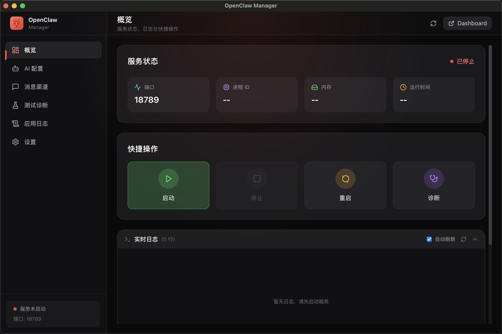
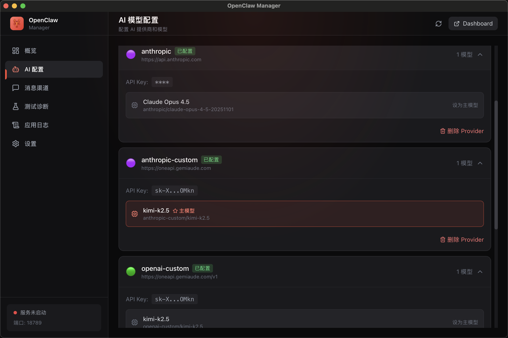
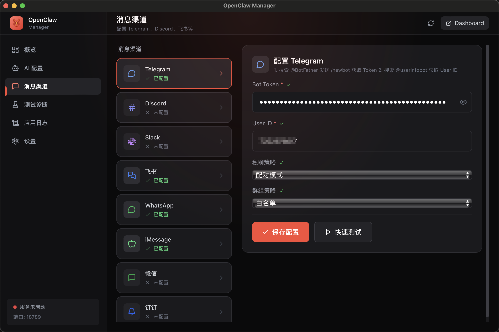
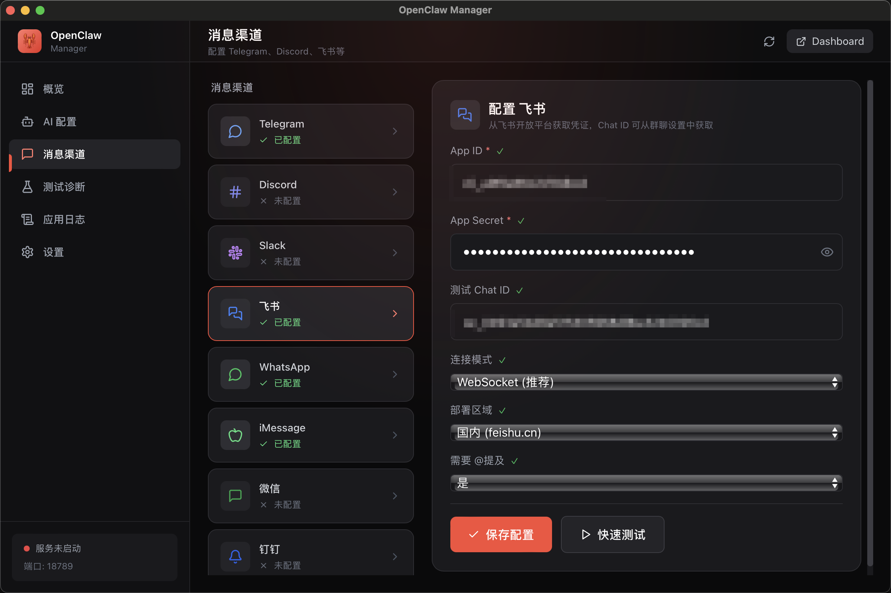
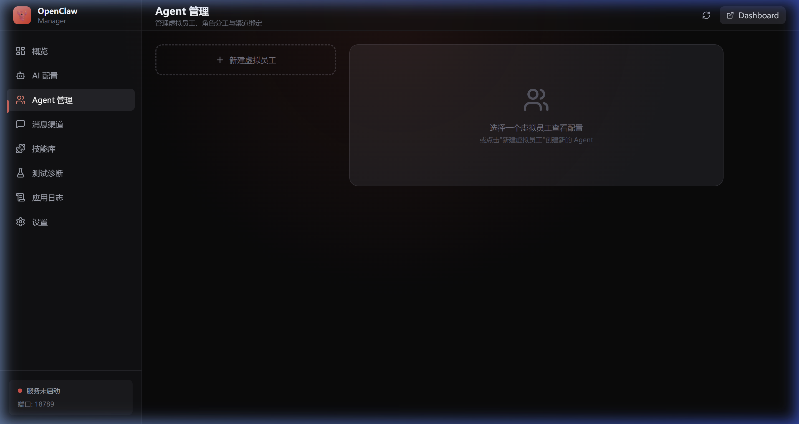
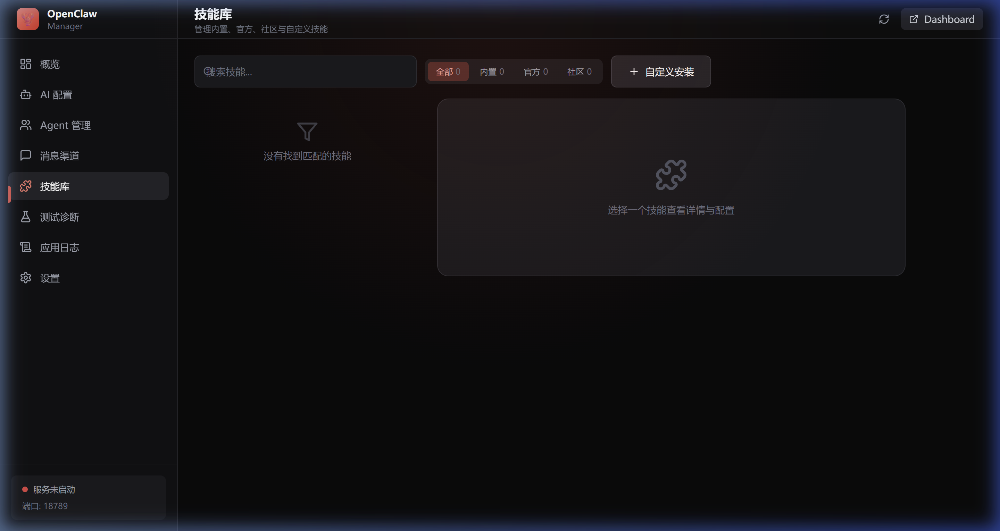

# 🦞 OpenClaw Manager

A high-performance cross-platform AI assistant management tool, built with **Tauri 2.0 + React + TypeScript + Rust**.

[中文文档](README.md)


---

## 📸 Screenshots

### 📊 Dashboard

Real-time service monitoring with one-click AI assistant management.



- Live service status (port, PID, memory, uptime)
- Quick actions: Start / Stop / Restart / Diagnose
- Real-time log viewer with auto-refresh

---

### 🤖 AI Model Configuration

Flexible multi-provider AI configuration with custom API endpoint support.



- 14+ AI providers (Anthropic, OpenAI, DeepSeek, Moonshot, Gemini, etc.)
- Custom API endpoints, compatible with OpenAI-format third-party services
- One-click primary model selection and quick switching

---

### 📱 Messaging Channels

Connect to multiple messaging platforms to build an omni-channel AI assistant.

<table>
  <tr>
    <td width="50%">
      
      <p align="center"><b>Telegram Bot</b></p>
    </td>
    <td width="50%">
      
      <p align="center"><b>Feishu (Lark) Bot</b></p>
    </td>
  </tr>
</table>

- **Telegram** — Bot Token, private/group chat policies
- **Feishu (Lark)** — App ID/Secret, WebSocket, multi-region deployment
- **More channels** — Discord, Slack, WhatsApp, iMessage, WeChat, DingTalk, QQ
- **Setup Guides** — Each channel includes a link to official documentation

---

### 🤝 Agent Management

Multi-agent system with independent identity, model, and channel assignments.



- Create and manage multiple virtual employees (Agents) with custom names, emoji identifiers, and role descriptions
- Each Agent can independently configure AI models, bind messaging channels, and set tool permissions
- Sandbox mode, workspace isolation, @mention mode, and sub-agent permission control
- One-click primary Agent designation for handling unbound channel messages

---

### 🧩 Skill Library

Unified management for built-in, official, community, and custom skill plugins.



- Browse and search all skills, filter by source (Built-in / Official / Community)
- One-click install, uninstall, enable, and disable
- Visual parameter configuration (text, password, dropdown, toggle)
- Custom installation via npm packages or local paths

---

### 🛡️ Security Protection

Comprehensive security risk detection and one-click remediation.

- **Security Alerts** — Prominent risk warnings about AI over-permissions that could lead to file loss, email mishaps, or data leaks
- **One-click Security Scan** — Auto-detect IP exposure, port binding, Gateway Token, skill permissions, config file permissions
- **Risk Prioritization** — High/Medium/Low severity ranking with checkbox list
- **One-click Fix** — Auto-remediate fixable issues; manual guidance provided for others

---

### 🎨 Theme Switching

Light/Dark dual-theme support, defaulting to light mode.

- **Light Mode** — Apple-style soft white design, clean and comfortable
- **Dark Mode** — Dark theme, easy on the eyes for extended use
- **One-click Toggle** — 🌙/☀️ button in the top navigation bar
- **Persistent State** — Theme preference preserved across refreshes and restarts

---

## ✨ Features

| Module | Description |
|--------|-------------|
| 📊 **Dashboard** | Real-time service monitoring, process stats, one-click start/stop/restart |
| 🤖 **AI Configuration** | 14+ AI providers, custom API endpoints, quick model switching |
| 📱 **Messaging Channels** | Telegram, Discord, Slack, Feishu, WeChat, iMessage, DingTalk, QQ — each with setup docs |
| 🤝 **Agent Management** | Multi-agent system, role assignment, model override, channel binding, sandbox isolation |
| 🧩 **Skill Library** | Browse, install, configure, and manage skill plugins |
| 🛡️ **Security** | IP exposure detection, port security, token auth, skill permission scan, one-click fix |
| ⚡ **Service Control** | Background service management, real-time logs, auto-start on boot |
| 🧪 **Diagnostics** | System health check, AI connectivity test, channel connectivity test |
| 🎨 **Themes** | Light / Dark mode with persistent preference |

## 🚀 Quick Start

### Option 1: Download Pre-built Binaries

Download the installer for your platform from GitHub Releases — no development environment required.

👉 **[Download Latest Release](https://github.com/VillageMoonlight/openclaw-manager/releases/latest)**

| Platform | Format | Installation |
|----------|--------|--------------|
| **macOS** | `.dmg` | Open the DMG and drag the app to Applications |
| **Windows** | `.msi` / `.exe` | Run the installer wizard |
| **Linux** | `.deb` / `.AppImage` | `sudo dpkg -i *.deb` or run the AppImage directly |

> ⚠️ **macOS users**: If you see a "damaged, can't be opened" warning, run:
> ```bash
> xattr -cr /Applications/OpenClaw\ Manager.app
> ```
> Or go to **System Preferences > Privacy & Security** and click **Open Anyway**.

---

### Option 2: Build from Source

#### Prerequisites

- **Node.js** >= 18.0
- **Rust** >= 1.70
- **npm** or pnpm

#### Platform-specific Dependencies

<details>
<summary><b>macOS</b></summary>

```bash
xcode-select --install
```
</details>

<details>
<summary><b>Windows</b></summary>

- [Microsoft C++ Build Tools](https://visualstudio.microsoft.com/visual-cpp-build-tools/)
- [WebView2](https://developer.microsoft.com/en-us/microsoft-edge/webview2/)
</details>

<details>
<summary><b>Linux (Ubuntu/Debian)</b></summary>

```bash
sudo apt update
sudo apt install libwebkit2gtk-4.1-dev build-essential curl wget file \
  libxdo-dev libssl-dev libayatana-appindicator3-dev librsvg2-dev \
  libgtk-3-dev libsoup-3.0-dev libjavascriptcoregtk-4.1-dev
```
</details>

#### Build & Run

```bash
# Clone the repository
git clone https://github.com/VillageMoonlight/openclaw-manager.git
cd openclaw-manager

# Install dependencies
npm install

# Development mode (with hot reload)
npm run tauri dev

# Build production release
npm run tauri build
```

#### Build Output

After running `npm run tauri build`, installers are generated in `src-tauri/target/release/bundle/`:

| Platform | Format |
|----------|--------|
| macOS | `.dmg`, `.app` |
| Windows | `.msi`, `.exe` |
| Linux | `.deb`, `.AppImage` |

## 📁 Project Structure

```
openclaw-manager/
├── src-tauri/                 # Rust backend
│   ├── src/
│   │   ├── main.rs            # Entry point
│   │   ├── commands/          # Tauri Commands
│   │   │   ├── service.rs     # Service management
│   │   │   ├── config.rs      # Configuration management
│   │   │   ├── process.rs     # Process management
│   │   │   └── diagnostics.rs # Diagnostics + Security scan
│   │   ├── models/            # Data models
│   │   └── utils/             # Utility functions
│   ├── Cargo.toml
│   └── tauri.conf.json
│
├── src/                       # React frontend
│   ├── App.tsx
│   ├── lib/
│   │   └── ThemeContext.tsx    # Theme switching
│   ├── components/
│   │   ├── Layout/            # Layout (Sidebar + Header)
│   │   ├── Dashboard/         # Dashboard
│   │   ├── AIConfig/          # AI configuration
│   │   ├── Channels/          # Channel configuration
│   │   ├── Agents/            # Agent management
│   │   ├── Skills/            # Skill library
│   │   ├── Security/          # Security protection
│   │   ├── Testing/           # Test & diagnostics
│   │   ├── Logs/              # Application logs
│   │   └── Settings/          # Settings
│   └── styles/
│       └── globals.css        # Theme variables + global styles
│
├── package.json
├── vite.config.ts
└── tailwind.config.js
```

## 🛠️ Tech Stack

| Layer | Technology | Purpose |
|-------|------------|---------|
| Frontend | React 18 | User interface |
| Styling | TailwindCSS + CSS Variables | Theme switching + utility CSS |
| Animation | Framer Motion | Smooth transitions |
| Icons | Lucide React | Beautiful icon set |
| Backend | Rust | High-performance system calls |
| Cross-platform | Tauri 2.0 | Native app wrapper |

## 🔧 Development Commands

```bash
npm run tauri dev        # Dev mode (hot reload)
npm run dev              # Frontend only
npm run build            # Build frontend
npm run tauri build      # Build full application
cd src-tauri && cargo check   # Check Rust code
```

## 🤝 Contributing

1. Fork the repository
2. Create a feature branch (`git checkout -b feature/amazing-feature`)
3. Commit your changes (`git commit -m 'Add amazing feature'`)
4. Push to the branch (`git push origin feature/amazing-feature`)
5. Open a Pull Request

## 📄 License

MIT License — see [LICENSE](LICENSE)

## 🔗 Links

- [OpenClaw](https://github.com/miaoxworld/openclaw) — OpenClaw core project
- [OpenClawInstaller](https://github.com/miaoxworld/OpenClawInstaller) — CLI installer
- [Tauri Documentation](https://tauri.app/)

---

**Made with ❤️ by OpenClaw Community**
